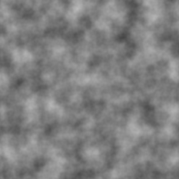
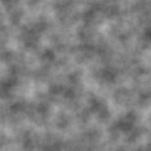

# noise-algorithms (Python)

A collection of noise generation algorithms in **pure Python** (no runtime
dependencies). Part of the [noise-algorithms](https://github.com/quentinpigne/noise-algorithms)
monorepo.

## Preview

Perlin noise rendered from the built wheel (`seed=42`, `scale=0.03`) — these are
the snapshots the integration tests verify:

| 1D | 2D | 3D (z = 0 slice) |
| :-: | :-: | :-: |
|  |  |  |

## Installation

```sh
pip install noise-algorithms
```

## Usage

The API is functional: call a `perlin_*` function with coordinates and an
optional `PerlinConfig`. Every function returns fractal (multi-octave) noise in
the `[-1, 1]` interval.

```python
from noise_algorithms import PerlinConfig, perlin_1d, perlin_2d, perlin_3d

# Default configuration (seed=0, scale=0.01, octaves=4, lacunarity=2, persistence=0.5)
value = perlin_2d(12.0, 7.0)

# Custom configuration
config = PerlinConfig(seed=42, scale=0.05, octaves=6, lacunarity=2.0, persistence=0.5)
a = perlin_1d(3.0, config)
b = perlin_2d(3.0, 4.0, config)
c = perlin_3d(3.0, 4.0, 5.0, config)
```

### `PerlinConfig`

| Field | Default | Description |
| --- | --- | --- |
| `seed` | `0` | Seed for the permutation table; same seed → same field. |
| `scale` | `0.01` | Base frequency multiplier applied to the coordinates. |
| `octaves` | `4` | Number of noise layers summed together. |
| `lacunarity` | `2.0` | Frequency multiplier between successive octaves. |
| `persistence` | `0.5` | Amplitude multiplier between successive octaves. |

## Development

This package uses [uv](https://docs.astral.sh/uv/).

```sh
uv sync                 # install dev dependencies
uv run pytest           # unit + integration tests
uv run ruff check .     # lint
uv run ruff format .    # format
uv build                # build sdist + wheel
```

The integration test (`tests/integration/`) builds the wheel, imports it from an
isolated environment, renders a noise image and compares it to the committed
snapshot in `tests/snapshots/`; the rendered image is written to `tests/output/`.
Refresh the snapshot with `UPDATE_SNAPSHOTS=1 uv run pytest tests/integration`.

### Generating a preview image

```sh
uv run --extra images python examples/generate_images.py
```

## License

[MIT](./LICENSE)
