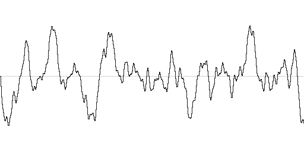
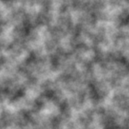
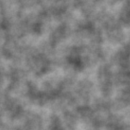

# @quentinpigne/noise-algorithms

A collection of noise generation algorithms in **TypeScript**, shipped as an
ESM library with type definitions. Part of the
[noise-algorithms](https://github.com/quentinpigne/noise-algorithms) monorepo.

## Preview

Perlin noise rendered from the built library (`seed=42`, `frequency=0.03`) — these
are the snapshots the integration tests verify:

|              1D (signal graph)               |                  2D (field)                  |            3D (Swiss cheese cube)            |
| :------------------------------------------: | :------------------------------------------: | :------------------------------------------: |
|  |  |  |

## Installation

From npm:

```sh
npm install @quentinpigne/noise-algorithms
```

Requires Node.js ≥ 18. This package is also published to **GitHub Packages**. To install from there,
add a scoped registry to your `.npmrc`:

```
@quentinpigne:registry=https://npm.pkg.github.com
```

## Usage

Every generator exposes a `noise(...)` method returning a value in the `[-1, 1]`
interval. Each algorithm lives under `/perlin-noise` and offers four entry
points per dimension — a **class** (reuse it for repeated sampling) and a
one-shot **function** (builds a generator per call), in **single-octave** and
**fractal** flavours:

|               | Class                  | Function                          |
| ------------- | ---------------------- | --------------------------------- |
| Single octave | `PerlinNoise2D`        | `perlin2D(x, y, options?)`        |
| Fractal (fBm) | `FractalPerlinNoise2D` | `fractalPerlin2D(x, y, options?)` |

```ts
import {
  PerlinNoise2D,
  perlin2D,
  FractalPerlinNoise2D,
  fractalPerlin2D,
} from "@quentinpigne/noise-algorithms/perlin-noise";

// Single octave
new PerlinNoise2D({ seed: 42 }).noise(12, 7);
perlin2D(12, 7, { seed: 42 });

// Fractal (multi-octave)
new FractalPerlinNoise2D({ seed: 42, octaves: 6 }).noise(12, 7);
fractalPerlin2D(12, 7, { seed: 42, octaves: 6 });
```

Fractal layering (fBm) is a **technique** for stacking octaves, not a noise
algorithm in itself. The shared octave-stacking engine lives in the abstract
`FractalNoiseGenerator` base (and the `FractalNoiseGenerator{1,2,3}D`
interfaces); `FractalPerlinNoise2D` is the Perlin implementation. The base is
exported as an abstraction — there is no concrete generic wrapper to instantiate
with an arbitrary source.

The package root re-exports the shared abstractions and interfaces:

```ts
import {
  NoiseGenerator,
  NoiseGenerator1D,
  NoiseGenerator2D,
  NoiseGenerator3D,
} from "@quentinpigne/noise-algorithms";
```

### Parameters

A Perlin generator takes only a `seed` (optional; defaults to `0`). The same
seed produces the same field in both the TypeScript and Python packages.

```ts
new PerlinNoise2D({ seed? });
```

A fractal generator takes the layering options (all optional):

```ts
new FractalPerlinNoise2D({ seed?, octaves?, lacunarity?, persistence?, frequency? });
```

| Parameter     | Default | Description                                      |
| ------------- | ------- | ------------------------------------------------ |
| `octaves`     | `4`     | Number of noise layers summed together.          |
| `lacunarity`  | `2`     | Frequency multiplier between successive octaves. |
| `persistence` | `0.5`   | Amplitude multiplier between successive octaves. |
| `frequency`   | `0.01`  | Base frequency applied to the first octave.      |

The `FractalPerlinNoise{1,2,3}D` classes and `fractalPerlin{1,2,3}D` functions
accept `seed` plus all of the above.

### Sampling over a region

Most of the time you want a whole curve, image or volume rather than a single
value. The generic `sampleLine` / `sampleGrid` / `sampleVolume` helpers take
_any_ generator (single-octave or fractal) and return nested arrays:

```ts
import { FractalPerlinNoise2D } from "@quentinpigne/noise-algorithms/perlin-noise";
import { sampleGrid } from "@quentinpigne/noise-algorithms";

const gen = new FractalPerlinNoise2D({ seed: 42, frequency: 0.03 });
const image = sampleGrid(gen, { width: 256, height: 256 }); // image[y][x] in [-1, 1]
```

- `sampleLine(gen, { count })` → `number[]`
- `sampleGrid(gen, { width, height })` → `number[][]` (`grid[y][x]`)
- `sampleVolume(gen, { width, height, depth })` → `number[][][]` (`volume[z][y][x]`)

Each also accepts an optional origin (`start` / `startX` / `startY` / `startZ`)
and `step` — sample `i` maps to coordinate `start + i * step` (defaults: origin
`0`, step `1`).

For the common one-liner, the `perlin-noise` entry point also ships one-shot
region helpers that build the generator and sample it in a single call —
`perlinLine` / `perlinGrid` / `perlinVolume` and their `fractalPerlin…`
counterparts:

```ts
import { fractalPerlinGrid } from "@quentinpigne/noise-algorithms/perlin-noise";

const image = fractalPerlinGrid({
  seed: 42,
  frequency: 0.03,
  width: 256,
  height: 256,
});
```

### Output range

Every generator outputs the full `[-1, 1]` range. Need `[0, 1]` instead (for a
grayscale image or heightmap)? Apply the `toUnitRange` helper to a value or map
it over a sample:

```ts
import { fractalPerlinGrid } from "@quentinpigne/noise-algorithms/perlin-noise";
import { toUnitRange } from "@quentinpigne/noise-algorithms";

const image = fractalPerlinGrid({
  seed: 42,
  frequency: 0.03,
  width: 256,
  height: 256,
});
const grayscale = image.map((row) => row.map(toUnitRange)); // values in [0, 1]
```

## Development

```sh
npm install
npm test               # unit tests (Vitest)
npm run build          # bundle to dist/ with type declarations (tsdown)
npm run test:integration  # build, then render an image from dist/ and snapshot it
npm run lint           # ESLint
npm run format         # Prettier (write); use format:check in CI
```

Integration tests render a noise image from the built library and compare it to
the committed snapshot in `tests/snapshots/`; the rendered image is written to
`tests/output/` for inspection. Refresh the snapshot with
`UPDATE_SNAPSHOTS=1 npm run test:integration`.

A helper script under [`scripts/`](./scripts) can render the noise to PNG
images (requires [`tsx`](https://github.com/privatenumber/tsx)):

```sh
npx tsx scripts/generate-perlin-noise-images.ts --output ./images
```

## License

[MIT](./LICENSE)
